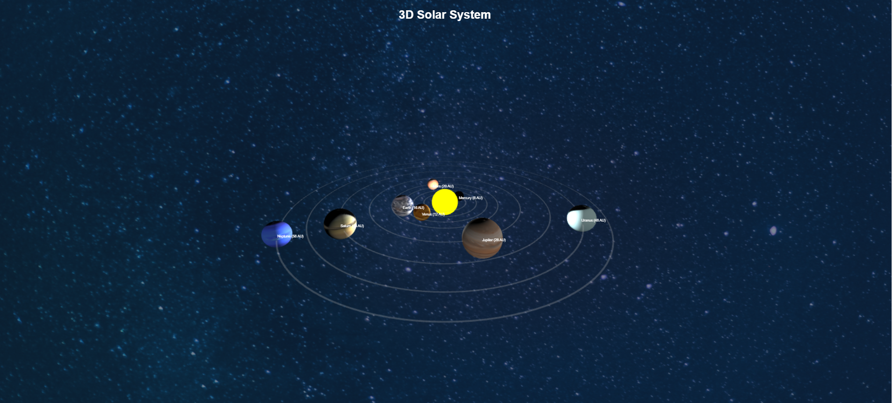

# 3D Solar System

This project is a **3D interactive solar system** built using **Three.js**. It allows users to rotate, zoom, and move freely to explore planets in real-time.

- [See The Solar-System](https://mobasaradev.github.io/solor_system/) (for 3D rendering)

## Features
- 🌍 **Realistic 3D planets** with accurate textures.
- 🌀 **Dynamic orbits** for each planet.
- 🖱️ **Hover effects** on planet names.
- 🎥 **Free camera movement** to explore the solar system from different angles.

## Screenshot


To adjust the size of the image in HTML, use:
```html

```

## Installation
1. Clone this repository:
   ```bash
   git clone https://github.com/your-repo/solar-system-3d.git
   ```
2. Open `index.html` in your browser.

## Usage
- **Mouse Left Click + Drag** → Rotate the view.
- **Scroll Wheel** → Zoom in/out.
- **Right Click + Drag** → Move the camera.

## Dependencies
- [Three.js](https://threejs.org/) (for 3D rendering)
- [OrbitControls.js](https://threejs.org/examples/js/controls/OrbitControls.js) (for camera movement)

## License
This project is open-source and available under the [MIT License](LICENSE).
